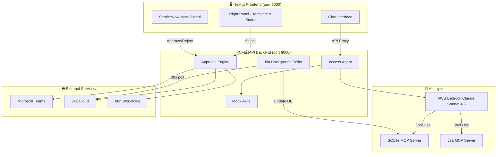
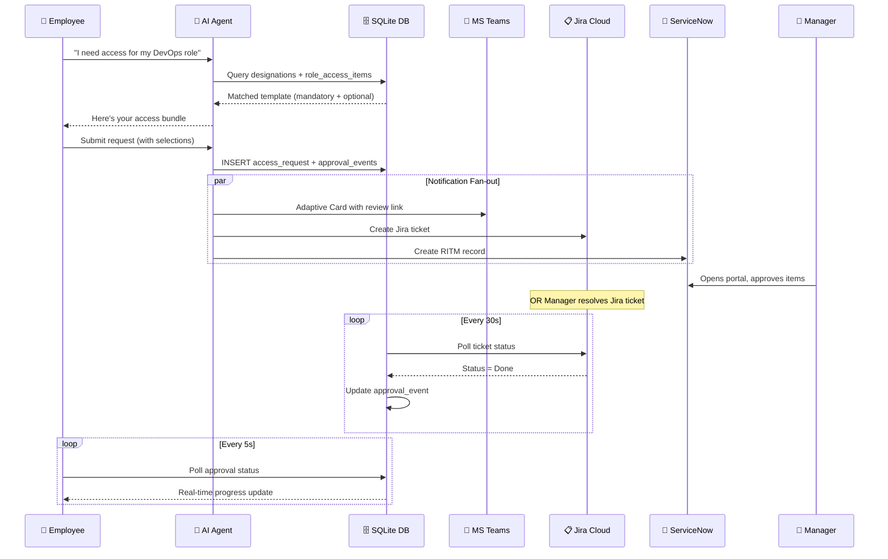

<p align="center">
  
  
</p>

<h1 align="center">🤖 AI-Powered Access Provisioning System</h1>

<p align="center">
  <em>Replacing fragmented IT access workflows with an intelligent conversational agent</em>
</p>

<p align="center">
  
  
  
  
  
  
  
  
  
  
</p>

---

## 🎯 The Problem

Enterprise employees waste **hours** navigating fragmented portals, sending emails, and chasing approvers just to get access to the tools they need. Multiple systems, unclear workflows, and manual routing create bottlenecks that slow onboarding and reduce productivity.

## 💡 Our Solution

A single **AI-powered chat interface** where employees describe what they need in natural language. The system:

- **Verifies identity** automatically via ACF2 ID lookup
- **Matches roles** to pre-configured access templates using Claude's reasoning
- **Presents access bundles** with mandatory and optional items
- **Routes approvals** to the right managers via Teams, ServiceNow, and Jira
- **Tracks progress** with real-time status updates — no page refresh needed

> One conversation. Zero portal-hopping. Full audit trail.

---

## 🏗️ Architecture



---

## 🔄 Approval Flow



---

## ✨ Key Features

| Feature | Description |
|---------|-------------|
| 🗣️ **Conversational AI** | Natural language access requests powered by Claude tool-use |
| 🎯 **Smart Role Matching** | AI resolves vague descriptions ("I do cloud stuff") to exact templates |
| 🧩 **Agent Reasoning** | Expandable panel shows how the AI matched the role |
| 📡 **Multi-channel Approval** | ServiceNow + Teams Adaptive Cards + Jira tickets |
| ⚡ **Real-time Status** | Background polling auto-updates UI without page refresh |
| 🚨 **Dangerous Combos** | Detects conflicting access pairs (e.g., prod write + deploy pipeline) |
| 📝 **Full Audit Trail** | Every action logged with timestamps and actor |
| 🔌 **MCP Architecture** | Clean separation between AI decisions and data operations |
| 💾 **Session Persistence** | Conversations restored across browser sessions |

---

## 🖼️ Screenshots

<details>
<summary><strong>Click to expand screenshots</strong></summary>

| Screen | Description |
|--------|-------------|
|  | ACF2 ID login gate |
|  | AI conversation with role matching |
|  | Right panel showing access template |
|  | ServiceNow approval portal |
|  | Teams Adaptive Card notification |

> *Screenshots will be added during demo preparation*

</details>

---

## 🚀 Quick Start

### Prerequisites

| Tool | Version | Purpose |
|------|---------|---------|
| Python | 3.11+ | Backend runtime |
| Node.js | 18+ LTS | Frontend runtime |
| AWS credentials | Bedrock access | LLM provider |
| Git | Recent | Version control |

### Backend

```bash
cd backend
python -m venv .venv
.venv\Scripts\activate          # Windows
# source .venv/bin/activate     # macOS/Linux
pip install -r requirements.txt
cp .env.example .env            # Fill in AWS creds, Jira token, Teams webhook
python scripts/seed_sqlite.py
uvicorn src.main:app --reload --port 8000
```

### Frontend

```bash
cd frontend
npm install
cp .env.example .env            # Set BACKEND_URL=http://localhost:8000
npm run dev
```

Open **http://localhost:3000** and log in with a demo user below.

---

## 👥 Demo Users

| ACF2 ID | Password | Name | Role | Scenario |
|---------|----------|------|------|----------|
| `ARUN01` | `arun123` | Arun Mehta | DevOps / Cloud Engineer | ✅ Happy path — full flow |
| `NEHA02` | `neha123` | Neha Kapoor | Finance Analyst | ⚠️ Privilege guard scenario |
| `SARA03` | `sara123` | Sara Chen | Unmapped | 🔄 Triggers manual role matching |
| `RAJ01` | `raj123` | Raj Kumar | Manager/Approver | 👔 Approval portal access |

---

## 🧭 User Journey

```
1️⃣  Employee logs in with ACF2 ID + password
2️⃣  AI agent checks existing role assignment, confirms with user
3️⃣  If confirmed → loads access template instantly (no LLM call needed)
4️⃣  If different → user states new role → AI queries designations → matches template
5️⃣  Right panel displays mandatory + optional access items
6️⃣  User toggles optional items, clicks Submit
7️⃣  Backend creates approval events, sends Teams notification, creates Jira tickets
8️⃣  Manager approves via ServiceNow portal OR Jira (status = Done)
9️⃣  Background poller detects Jira approval → updates DB → UI auto-updates
🔟  User sees real-time approval progress in right panel
```

---

## 🛠️ Tech Stack

| Layer | Technology | Purpose |
|-------|------------|---------|
| **Frontend** | Next.js 16, React 19, TypeScript | Server-rendered chat UI |
| **Styling** | Tailwind CSS v4 | Utility-first responsive design |
| **Backend** | Python, FastAPI, uvicorn | API server + async workers |
| **AI/LLM** | AWS Bedrock Claude Sonnet 4.6 | Tool-use / function-calling agent |
| **Database** | SQLite (via MCP) | Lightweight, zero-config persistence |
| **MCP Servers** | SQLite MCP, Jira MCP | Structured tool interface for AI |
| **Notifications** | Microsoft Teams (Adaptive Cards) | Manager approval alerts |
| **Ticketing** | Jira Cloud | Approval tracking + status polling |
| **ITSM** | ServiceNow (mock portal) | Manager approval UI |
| **Automation** | n8n | Webhook-driven workflow routing |
| **Mock APIs** | Workday, Active Directory, Jira, SAM | Enterprise system simulation |

---

## 📁 Project Structure

<details>
<summary><strong>Backend</strong></summary>

```
backend/
├── src/
│   ├── main.py                 # FastAPI app, Jira background poller
│   ├── types.py                # Pydantic models
│   ├── agent/
│   │   └── index.py            # AI agent (Phases 1-3: identity, role, submission)
│   ├── routes/
│   │   ├── agent.py            # /api/agent/message
│   │   ├── approvals.py        # /api/approvals/* (submit, status, action)
│   │   ├── auth.py             # /api/auth/login
│   │   ├── servicenow.py       # /api/servicenow/* (mock RITM portal)
│   │   ├── conversations.py    # /api/conversations (persistence)
│   │   └── admin.py            # /api/admin/*
│   ├── lib/
│   │   ├── bedrock.py          # AWS Bedrock Claude client
│   │   ├── sqlite.py           # DB connection helper
│   │   └── logger.py           # Structured logging
│   └── mock/                   # Workday, AD, Jira, SAM mock APIs
├── mcp_server/
│   ├── sqlite_server.py        # SQLite MCP (query_db, execute_db)
│   └── jira_server.py          # Jira MCP (create_jira_ticket, get_jira_status)
├── scripts/
│   └── seed_sqlite.py          # Database seeding (8 roles, 51 access items)
└── requirements.txt
```

</details>

<details>
<summary><strong>Frontend</strong></summary>

```
frontend/
├── src/
│   ├── app/
│   │   ├── page.tsx            # Login gate + main layout
│   │   ├── servicenow/         # Mock ServiceNow approver portal
│   │   ├── my-requests/        # User request history
│   │   ├── admin/              # Admin panel
│   │   └── api/                # Next.js API proxies to backend
│   ├── components/
│   │   ├── layout/
│   │   │   ├── ChatPanel.tsx   # AI chat interface
│   │   │   ├── RightPanel.tsx  # Template display + approval tracker
│   │   │   └── Sidebar.tsx     # Conversation history + navigation
│   │   └── chat/
│   │       ├── ChatInput.tsx   # Message input
│   │       ├── MessageBubble.tsx
│   │       └── TypingIndicator.tsx
│   ├── contexts/
│   │   └── SessionContext.tsx  # Global state management
│   ├── hooks/
│   │   └── useChat.ts          # Chat message handling
│   └── lib/
│       └── types.ts            # TypeScript types
└── package.json
```

</details>

---

## 🔐 Environment Variables

<details>
<summary><strong>Backend (.env)</strong></summary>

| Variable | Description |
|----------|-------------|
| `AWS_ACCESS_KEY_ID` | AWS credentials for Bedrock |
| `AWS_SECRET_ACCESS_KEY` | AWS secret key |
| `AWS_SESSION_TOKEN` | Session token (if using temporary creds) |
| `AWS_REGION` | AWS region (default: `us-east-1`) |
| `BEDROCK_MODEL_ID` | `us.anthropic.claude-sonnet-4-6` |
| `SQLITE_DB_PATH` | Path to SQLite database |
| `TEAMS_WEBHOOK_URL` | MS Teams Incoming Webhook URL |
| `JIRA_BASE_URL` | Jira Cloud instance URL |
| `JIRA_EMAIL` | Jira service account email |
| `JIRA_API_TOKEN` | Jira API token |
| `JIRA_PROJECT_KEY` | Jira project key for tickets |
| `N8N_WEBHOOK_URL` | n8n automation webhook |

</details>

<details>
<summary><strong>Frontend (.env)</strong></summary>

| Variable | Description |
|----------|-------------|
| `BACKEND_URL` | `http://localhost:8000` |

</details>

---

## 📊 Database Schema

```
users                    — Employee records (ACF2 ID, name, team, manager)
user_designations        — Role assignments per employee
designations             — Role definitions (8 seeded)
role_access_items        — Access items per role (51 seeded)
access_requests          — Submitted access bundles
approval_events          — Per-item approval status tracking
approver_routing         — Manager routing rules
audit_log                — Full audit trail with timestamps
privilege_edges          — Access dependency graph
dangerous_combinations   — Conflicting access pair detection
conversations            — Chat session persistence
messages                 — Message history
```

---

## 🧪 Verification

```bash
# Backend compilation check
cd backend && python -m compileall src mcp_server scripts

# Frontend lint + build
cd frontend && npm run lint && npm run build
```

---

## 🏆 What Makes This Special

| Differentiator | Why It Matters |
|---------------|----------------|
| **MCP-native AI** | Claude uses structured tools (not prompt hacks) to query/write data |
| **Zero LLM calls for known roles** | Pre-assigned employees get instant templates — fast + cheap |
| **Multi-channel approval** | Managers approve wherever they already work (Teams, Jira, ServiceNow) |
| **Dangerous combination detection** | Prevents SoD violations before they reach approvers |
| **Agent reasoning transparency** | Users see *why* the AI chose their template — builds trust |
| **Production-ready patterns** | MCP separation, audit logging, session persistence |

---

## 👩‍💻 Team

<p align="center">
  <strong>Sun Life HackHERway 2025 — Problem Statement 6</strong><br/>
  <em>Building the future of enterprise access management</em>
</p>

---

<p align="center">
  <sub>Built with ❤️ at HackHERway 2025 | Powered by AWS Bedrock + Claude</sub>
</p>
