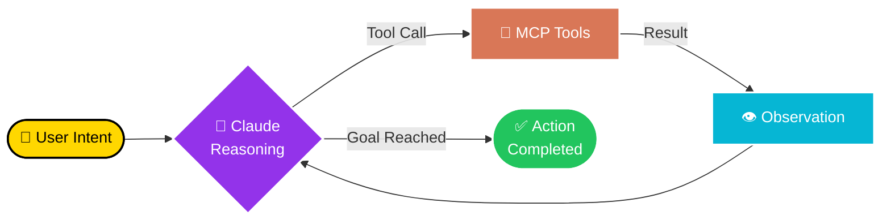
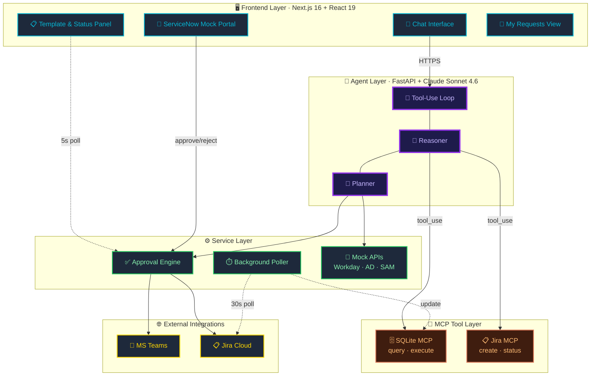
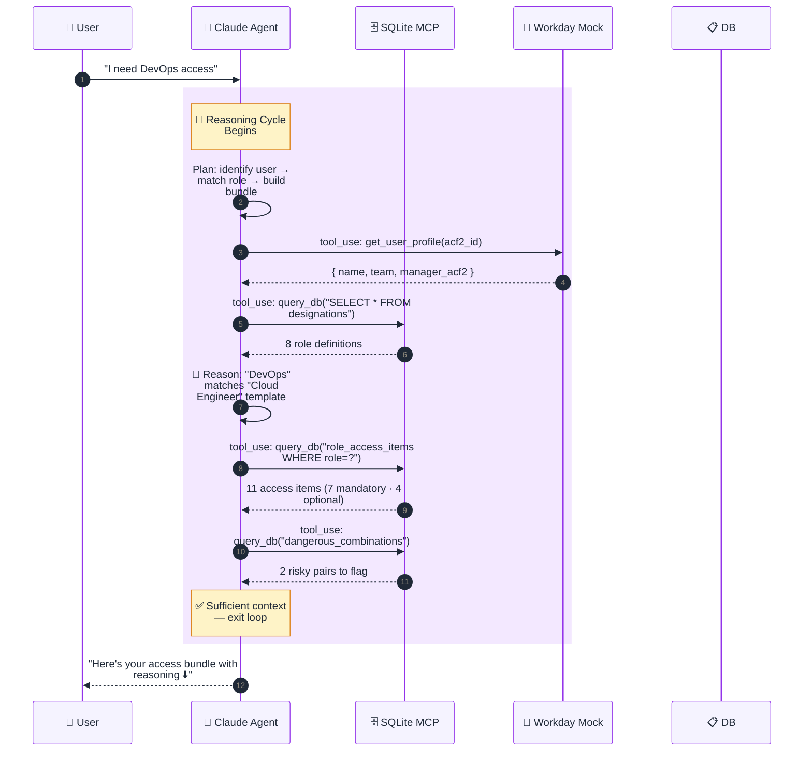
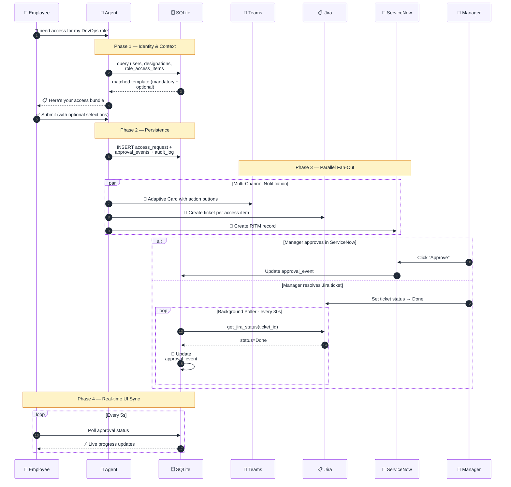

<div align="center">


<br/><br/>

# 🤖 Sunlife Enterprise Access Provisioning

### **An Agentic AI System for Enterprise Access Provisioning**

<p>
  <em>Hours of portal-hopping → one conversation with an autonomous agent</em>
</p>

<br/>

<p>
  
  
  
  
</p>

<p>
  
  
  
  
  
  
  
  
  
</p>

</div>

---

## 💭 The Problem

<table>
<tr>
<td width="50%">

**Today's Reality**

Enterprise access provisioning is fractured across:

- 🔀 Multiple disconnected portals
- 📧 Email chains chasing approvers
- 🎟️ Manual ticket creation
- ⏳ Multi-day onboarding delays
- 🕳️ No single source of truth
- 🗒️ Fragile audit trails

**Result:** Employees lose hours. Managers lose context. Security loses visibility.

</td>
<td width="50%">

**Our Vision**

A single agentic interface that **thinks, decides, and acts** on the user's behalf:

- 💬 One natural-language conversation
- 🧠 Autonomous role matching via reasoning
- 🔧 Multi-tool orchestration through MCP
- 📡 Cross-channel approval fan-out
- ⚡ Real-time state synchronization
- 🔒 Built-in privilege guardrails

**Result:** Minutes, not days. With a full audit trail.

</td>
</tr>
</table>

---

## 🛠️ Built With Claude Code

> This entire system — backend agent loop, MCP servers, FastAPI routes, the Next.js chat UI, the admin role-configuration panel, the mock enterprise stack, and even this documentation — was **built using Claude Code, Anthropic's agentic coding tool.** Every phase of the project (Phase 0A foundation through Phase 3 submission) was driven by Claude Code agents acting on the codebase: scaffolding new modules, refactoring across files, running tests, and iterating to a working build. Claude Code wasn't a helper here — it was the primary engineering partner.

---

## 🧠 What Makes This **Agentic**

This isn't a chatbot with scripted flows. It's a **goal-directed AI agent** powered by Claude Sonnet 4.6 that operates through a continuous **perceive → reason → act → observe** loop.



> The agent decides **which tools to call, in what order, and when to stop** — based on the conversation state and what it learns from each tool result.

### 🎯 Agentic Behaviors

<table>
<tr>
<td width="33%" align="center">

#### 🔍 **Autonomous Discovery**

Agent independently queries Workday, AD, and the role database to assemble a complete picture of who the user is — before responding.

</td>
<td width="33%" align="center">

#### 🧩 **Multi-Step Reasoning**

When a user says *"I do cloud stuff"*, the agent fetches all designations, compares them semantically, and proposes the best match — with confidence.

</td>
<td width="33%" align="center">

#### 🛡️ **Self-Imposed Guardrails**

Agent detects dangerous access combinations and **refuses to proceed** until the user acknowledges the SoD risk.

</td>
</tr>
<tr>
<td width="33%" align="center">

#### 🔄 **State-Aware Tool Use**

Agent skips redundant LLM calls when a known role is confirmed — directly loads cached templates for instant response.

</td>
<td width="33%" align="center">

#### 📡 **Parallel Orchestration**

Single submission triggers parallel tool calls: Teams card, Jira ticket, ServiceNow RITM, audit log — all reasoned about together.

</td>
<td width="33%" align="center">

#### ⏱️ **Async Continuation**

A background agent loop polls Jira every 30s, updates DB on status change, and pushes new state to the UI — fully autonomous.

</td>
</tr>
</table>

---

## 🏗️ System Architecture



---

## 🔁 The Agent Tool-Use Loop

Every user message enters a reasoning loop. The agent inspects available tools, decides what to call, observes the result, and iterates until it can confidently respond.



> **The agent runs this loop autonomously.** No hardcoded flow. Claude decides each step based on what it's observed so far.

---

## 🔧 Agent Tool Catalog

The agent has access to a **typed, structured set of tools** exposed via MCP servers. Each tool is described to Claude with a schema, and Claude chooses when and how to invoke them.

| Tool | MCP Server | Purpose | Reasoning Trigger |
|------|-----------|---------|-------------------|
| 🔍 `query_db` | SQLite | Read users, roles, access items, audit logs | Discovery, matching, validation |
| ✍️ `execute_db` | SQLite | Insert requests, approval events, audit rows | Persisting state after decisions |
| 🎫 `create_jira_ticket` | Jira | Create approval ticket in Jira Cloud | Fan-out after submission |
| 📊 `get_jira_status` | Jira | Poll ticket status for async resolution | Background reconciliation |
| 👤 `get_user_profile` | Mock Workday | Resolve ACF2 ID → identity | Identity verification phase |
| 🏢 `get_user_groups` | Mock AD/LDAP | List user's current security groups | Privilege accumulation check |
| 💬 `send_teams_card` | Teams Webhook | Adaptive Card to approver | Notification fan-out |

---

## 🌊 End-to-End Approval Flow



---

## ✨ Feature Highlights

<table>
<tr>
<td width="50%">

### 🤖 Agentic Intelligence

| | |
|---|---|
| 🗣️ | **Natural Language Requests** — Claude interprets vague intents like *"I do cloud stuff"* |
| 🧠 | **Tool-Use Reasoning** — Claude decides which DB queries, mock APIs, and integrations to call |
| 🔍 | **Agent Transparency Panel** — Users see *why* the AI chose their template |
| 🎯 | **Zero-LLM Fast Path** — Known roles bypass the LLM entirely for instant load |
| 🛡️ | **Autonomous Guardrails** — Agent self-detects SoD violations before submission |

</td>
<td width="50%">

### 🏛️ Enterprise Integration

| | |
|---|---|
| 📡 | **Multi-Channel Approvals** — Teams + Jira + ServiceNow in parallel |
| ⚡ | **Real-Time Sync** — 30s Jira poller + 5s UI poller = always fresh |
| 🚨 | **Dangerous Combo Detection** — Built-in privilege graph guards |
| 📝 | **Full Audit Trail** — Every agent decision + every human action logged |
| 💾 | **Session Persistence** — Conversations survive browser restarts |
| 🔌 | **MCP-Native** — Production-pattern tool/data separation |

</td>
</tr>
</table>

---

## 🚀 Quick Start

### Prerequisites

| Tool | Version | Purpose |
|------|---------|---------|
| 🐍 Python | 3.11+ | Backend runtime |
| 🟢 Node.js | 18+ LTS | Frontend runtime |
| ☁️ AWS Credentials | Bedrock access | LLM provider |
| 🔧 Git | Recent | Version control |

### 🔧 Backend Setup

```bash
cd backend
python -m venv .venv
.venv\Scripts\activate          # Windows
# source .venv/bin/activate     # macOS/Linux

pip install -r requirements.txt
cp .env.example .env            # Fill in AWS creds, Jira token, Teams webhook
python scripts/seed_sqlite.py   # Seeds 8 roles, 51 access items
uvicorn src.main:app --reload --port 8000
```

### 🎨 Frontend Setup

```bash
cd frontend
npm install
cp .env.example .env            # Set BACKEND_URL=http://localhost:8000
npm run dev
```

> Open **http://localhost:3000** to launch the app.

---

## 🧭 The Employee Journey

```
1️⃣   Employee logs in with ACF2 ID + password
        ↓
2️⃣   Agent autonomously fetches identity (Workday mock) + role context (SQLite)
        ↓
3️⃣   ✅ Known role?  →  Instant template load (zero LLM call — fast path)
       ❌ Unknown?    →  Agent reasons over all designations → proposes match
        ↓
4️⃣   Right panel reveals mandatory + optional access items
        ↓
5️⃣   Agent flags dangerous combinations — pauses if SoD risk detected
        ↓
6️⃣   User toggles options → Submit
        ↓
7️⃣   Agent fans out to Teams + Jira + ServiceNow in parallel
        ↓
8️⃣   Manager approves anywhere (ServiceNow UI or Jira ticket resolution)
        ↓
9️⃣   Background poller reconciles Jira state every 30s
        ↓
🔟   UI auto-refreshes every 5s — user sees live progress
```

---

## ⚙️ Admin Role Configuration

Roles aren't hardcoded into the agent — they're **fully managed at runtime** through a dedicated admin panel at `/admin/roles`. Hiring a new function? Adding a sub-team? Spinning off a variant of an existing role with one tweak? No code change, no redeploy, no DBA ticket. The agent picks up new roles on the **very next conversation**.

<table>
<tr>
<td width="33%" align="center">

#### ➕ **Create Role**

Define a new designation with title, description, team hint, and department hint. Then attach mandatory and optional access items one system at a time — Workday, AD, Jira, ServiceNow, anywhere.

</td>
<td width="33%" align="center">

#### ✏️ **Edit Role**

Update any field on an existing role — title, hints, descriptions — and add, modify, reorder, or remove its access items in place. Changes are live the moment they're saved.

</td>
<td width="33%" align="center">

#### 📋 **Copy Role**

Clone an existing role under a new ID **with every one of its access items duplicated**. Ideal for creating variants of a base role (e.g. "Cloud Engineer L1" → "Cloud Engineer L2") in seconds.

</td>
</tr>
</table>

### Access Item Workflow

Each role owns a list of `role_access_items`. The admin UI lets you:

- 📌 Flag each item as **mandatory** or **optional** — the agent enforces this when assembling a user's bundle
- 🏷️ Assign each item to a **system** (Workday, AD, Jira, etc.) and an **owner team** for downstream approval routing
- 🔗 Map each item to a **ServiceNow catalog item ID** for provisioning
- ↕️ **Reorder** items within the mandatory and optional groups with move-up / move-down controls
- 🗑️ Remove items, or delete an entire role (which cascades and cleans up its items)

### Architecture

The panel is backed by a thin REST surface under `/api/admin/*`, writing directly into the same SQLite schema (`designations` + `role_access_items`) that the agent reasons over. Dropdown values for teams, departments, systems, and owner teams are auto-derived from existing rows — so the catalog grows organically as new roles are added.

| Endpoint | Verb | Purpose |
|----------|------|---------|
| `/api/admin/designations` | `GET` / `POST` | List or create a role |
| `/api/admin/designations/{id}` | `PUT` / `DELETE` | Update or remove a role (cascades to items) |
| `/api/admin/designations/copy` | `POST` | Clone a role + every access item under a new ID |
| `/api/admin/designations/{id}/items` | `GET` / `POST` | List or add access items |
| `/api/admin/items/{item_id}` | `PUT` / `DELETE` | Update or remove a single access item |
| `/api/admin/options` | `GET` | Dropdown options (teams, depts, systems, owner_teams) |

> **Why this matters:** Most enterprise IAM systems require a developer or DBA to provision a new role. Here, an authorized admin opens the browser, fills out a form, and the agent's role catalog updates instantly — no restart, no cache invalidation, nothing.

---

## 🛠️ Technology Stack

<table>
<tr>
<th width="20%">Layer</th>
<th width="40%">Technology</th>
<th width="40%">Why It's Here</th>
</tr>
<tr>
<td><strong>🧠 AI Reasoning</strong></td>
<td>Claude Sonnet 4.6 via AWS Bedrock</td>
<td>Best-in-class tool-use and multi-step reasoning</td>
</tr>
<tr>
<td><strong>🔧 Tool Protocol</strong></td>
<td>Model Context Protocol (MCP)</td>
<td>Structured, typed tool interface — production pattern</td>
</tr>
<tr>
<td><strong>🖥️ Frontend</strong></td>
<td>Next.js 16 · React 19 · TypeScript 5</td>
<td>Server-rendered, streaming-ready chat UI</td>
</tr>
<tr>
<td><strong>🎨 Styling</strong></td>
<td>Tailwind CSS v4</td>
<td>Utility-first, fully responsive</td>
</tr>
<tr>
<td><strong>⚙️ Backend</strong></td>
<td>Python · FastAPI · uvicorn</td>
<td>Async API + background agent workers</td>
</tr>
<tr>
<td><strong>🗄️ Database</strong></td>
<td>SQLite via MCP</td>
<td>Zero-config persistence; all access via tool calls</td>
</tr>
<tr>
<td><strong>💬 Approvals</strong></td>
<td>MS Teams Adaptive Cards</td>
<td>Managers approve in their flow-of-work</td>
</tr>
<tr>
<td><strong>📋 Ticketing</strong></td>
<td>Jira Cloud (REST API)</td>
<td>Real ticket lifecycle + async status polling</td>
</tr>
<tr>
<td><strong>🔧 ITSM</strong></td>
<td>ServiceNow mock portal</td>
<td>Self-contained demo of approver UX</td>
</tr>
<tr>
<td><strong>🧪 Mocked Enterprise</strong></td>
<td>Workday · Active Directory · SAM</td>
<td>Demo enterprise systems for agent to query</td>
</tr>
</table>

---

## 📁 Project Structure

<details>
<summary><strong>🔧 Backend</strong> — Agent core, MCP servers, mock APIs</summary>

```
backend/
├── src/
│   ├── main.py                 # FastAPI app + Jira background poller
│   ├── types.py                # Pydantic models
│   ├── agent/
│   │   └── index.py            # 🧠 Agent loop (identity → role → submission)
│   ├── routes/
│   │   ├── agent.py            # /api/agent/message
│   │   ├── approvals.py        # /api/approvals/* (submit, status, action)
│   │   ├── auth.py             # /api/auth/login
│   │   ├── servicenow.py       # /api/servicenow/* (mock RITM portal)
│   │   ├── conversations.py    # /api/conversations (persistence)
│   │   └── admin.py            # /api/admin/*
│   ├── lib/
│   │   ├── bedrock.py          # 🧠 Claude Sonnet 4.6 client
│   │   ├── sqlite.py           # DB connection helper
│   │   └── logger.py           # Structured logging
│   └── mock/                   # Workday · AD · Jira · SAM
├── mcp_server/
│   ├── sqlite_server.py        # 🔧 SQLite MCP (query_db, execute_db)
│   └── jira_server.py          # 🔧 Jira MCP (create_jira_ticket, get_jira_status)
├── scripts/
│   └── seed_sqlite.py          # 8 roles · 51 access items
└── requirements.txt
```

</details>

<details>
<summary><strong>🎨 Frontend</strong> — Chat UI, approval panels, admin views</summary>

```
frontend/
├── src/
│   ├── app/
│   │   ├── page.tsx            # Login gate + main layout
│   │   ├── servicenow/         # 🔧 Mock ServiceNow approver portal
│   │   ├── my-requests/        # 📜 User request history
│   │   ├── admin/              # 🛠️ Admin panel
│   │   └── api/                # Next.js API proxies → FastAPI
│   ├── components/
│   │   ├── layout/
│   │   │   ├── ChatPanel.tsx   # 💬 AI chat interface
│   │   │   ├── RightPanel.tsx  # 📋 Template + approval tracker
│   │   │   └── Sidebar.tsx     # Conversation history + nav
│   │   └── chat/
│   │       ├── ChatInput.tsx
│   │       ├── MessageBubble.tsx
│   │       └── TypingIndicator.tsx
│   ├── contexts/
│   │   └── SessionContext.tsx  # Global state
│   ├── hooks/
│   │   └── useChat.ts          # Chat handling + agent comms
│   └── lib/
│       └── types.ts
└── package.json
```

</details>

---

## 🔐 Environment Variables

<details>
<summary><strong>Backend (.env)</strong></summary>

| Variable | Description |
|----------|-------------|
| `AWS_ACCESS_KEY_ID` | AWS credentials for Bedrock |
| `AWS_SECRET_ACCESS_KEY` | AWS secret key |
| `AWS_SESSION_TOKEN` | Session token (if using temporary creds) |
| `AWS_REGION` | AWS region (default: `us-east-1`) |
| `BEDROCK_MODEL_ID` | `us.anthropic.claude-sonnet-4-6` |
| `SQLITE_DB_PATH` | Path to SQLite database |
| `TEAMS_WEBHOOK_URL` | MS Teams Incoming Webhook URL |
| `JIRA_BASE_URL` | Jira Cloud instance URL |
| `JIRA_EMAIL` | Jira service account email |
| `JIRA_API_TOKEN` | Jira API token |
| `JIRA_PROJECT_KEY` | Jira project key for tickets |

</details>

<details>
<summary><strong>Frontend (.env)</strong></summary>

| Variable | Description |
|----------|-------------|
| `BACKEND_URL` | `http://localhost:8000` |

</details>

---

## 📊 Database Schema

```
users                    — Employee records (ACF2 ID, name, team, manager)
user_designations        — Role assignments per employee
designations             — Role definitions (8 seeded)
role_access_items        — Access items per role (51 seeded)
access_requests          — Submitted access bundles
approval_events          — Per-item approval status tracking
approver_routing         — Manager routing rules
audit_log                — Full audit trail with timestamps
privilege_edges          — Access dependency graph
dangerous_combinations   — Conflicting access pair detection
conversations            — Chat session persistence
messages                 — Message history
```

---

## 🧪 Verification

```bash
# Backend compilation check
cd backend && python -m compileall src mcp_server scripts

# Frontend lint + build
cd frontend && npm run lint && npm run build
```

---

## 🏆 What Sets This Apart

<table>
<tr>
<th>Differentiator</th>
<th>Why It Matters for the Jury</th>
</tr>
<tr>
<td>🔧 <strong>MCP-Native Agent</strong></td>
<td>Claude uses <em>structured, typed tools</em> — not prompt hacks. This is the production pattern Anthropic now ships for Claude Code and agentic systems.</td>
</tr>
<tr>
<td>🧠 <strong>True Tool-Use Loop</strong></td>
<td>The agent decides at every step whether to query more, write data, or respond. No hardcoded if/else flows.</td>
</tr>
<tr>
<td>⚡ <strong>Hybrid Fast-Path / Cold-Path</strong></td>
<td>Known roles skip the LLM entirely. Unknown roles trigger full reasoning. Cost-efficient by design.</td>
</tr>
<tr>
<td>📡 <strong>Parallel Channel Fan-Out</strong></td>
<td>One agent decision triggers Teams + Jira + ServiceNow + audit log simultaneously.</td>
</tr>
<tr>
<td>🛡️ <strong>Self-Imposed Guardrails</strong></td>
<td>Agent detects and refuses dangerous combinations — security baked into reasoning.</td>
</tr>
<tr>
<td>🔄 <strong>Autonomous Background Workers</strong></td>
<td>Continuous Jira polling + DB reconciliation runs without user prompting.</td>
</tr>
<tr>
<td>👁️ <strong>Reasoning Transparency</strong></td>
<td>Users see <em>why</em> the agent chose what it chose — building trust in AI decisions.</td>
</tr>
<tr>
<td>📝 <strong>Production-Grade Audit</strong></td>
<td>Every agent tool call and every human action timestamped and queryable.</td>
</tr>
</table>

---

<div align="center">

## 👩‍💻 Team

**Sun Life HackHERway 2025 · Problem Statement 6**

<br/>

<table>
<tr>
<td align="center" width="25%"><strong>Varuni Gupta</strong></td>
<td align="center" width="25%"><strong>Preeti Gaba</strong></td>
<td align="center" width="25%"><strong>Prashant Agarwal</strong></td>
<td align="center" width="25%"><strong>Salman Alam</strong></td>
</tr>
</table>

<br/>

*Building the future of enterprise access management — one autonomous decision at a time.*

<br/>

<sub>Built with ❤️ at HackHERway 2025</sub><br/>
<sub>🛠️ Engineered with Claude Code · 🧠 Powered by Claude Sonnet 4.6 · 🔧 Orchestrated via MCP · ☁️ Hosted on AWS Bedrock</sub>

<br/><br/>


</div>
